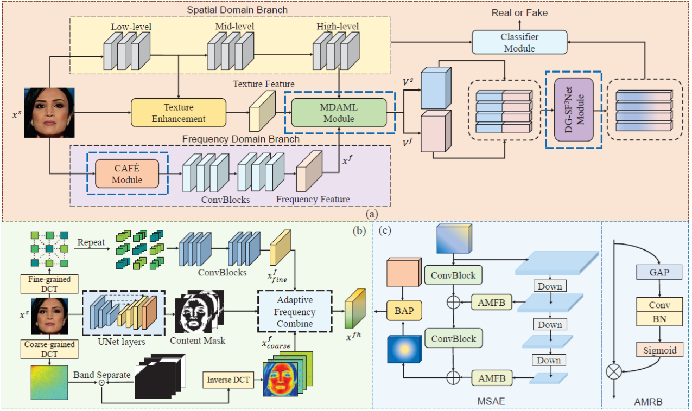
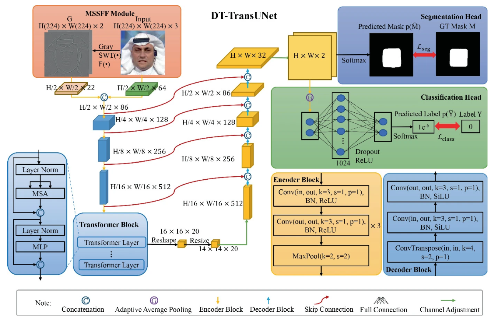
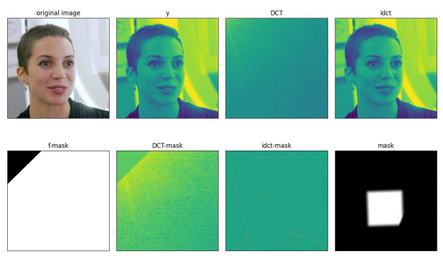

# SFDG-DCT-SWT

SFDG, DCT and SWT: Three Methods for Deepfake Detection

## 🏗️ Method Overview

This repository provides three deepfake detection algorithms based on spatial-frequency feature extraction:

### SFDG Framework

<p align="center">
  
</p>

### SWT Framework

<p align="center">
  
</p>

### DCT Results

<p align="center">
  
</p>

## 🔧 Installation

### 1. Clone repository

```bash
git clone https://github.com/SigmaLab-BJUT/SFDG-DCT-SWT.git
cd SFDG-DCT-SWT
```

### 2. Create environment

```bash
conda create -n deepfake-detect python=3.10
conda activate deepfake-detect
```

### 3. Install PyTorch

```bash
# CUDA 12.6
pip install torch==2.5.1+cu126 torchvision==0.20.1+cu126 \
    --index-url https://download.pytorch.org/whl/cu126
```

### 4. Install other dependencies

```bash
# For SFDG algorithm
pip install dlib kornia albumentations scikit-image opencv-python pillow matplotlib numpy

# For DCT & SWT algorithms
pip install opencv-python pillow matplotlib numpy scikit-image PyWavelets


## 📦 Pretrained Models

We provide pretrained models for evaluation and reproduction.

```text
SFDG-DCT-SWT/
|-- SFDG_Project/
|   |-- checkpoints/
|   |   |-- Freq2_LBP_Graph_23/
|   |       |-- ckpt_29.pth
|   |-- runs/
|       |-- Freq2_LBP_Graph_23/
|           |-- config.pkl
|-- SWT&DCT/
    |-- model_weight/
    |   |-- swt_pspnet.pt
    |   |-- dct.pt
    |-- faceUtil/
        |-- pre_model_weight/
            |-- RetinaFace-Resnet50-fixed.pth
```

| Model | File | Description |
|-------|------|-------------|
| SFDG | `SFDG_Project/checkpoints/Freq2_LBP_Graph_23/ckpt_29.pth` | MAT-based graph network with LBP features |
| DCT | `SWT&DCT/model_weight/dct.pt` | Two-stream EfficientNet-B4 with DCT input |
| SWT | `SWT&DCT/model_weight/swt_pspnet.pt` | PSPENet-B4 with SWT multi-scale features |
| RetinaFace | `SWT&DCT/faceUtil/pre_model_weight/RetinaFace-Resnet50-fixed.pth` | Face detection backbone |

## 🎬 Test Samples

We provide several test samples for quick evaluation.
```
SFDG-DCT-SWT
└── SWT&DCT
    └── test_image
        ├── swt
        │   ├── 001-36-real.jpg
        │   ├── 000_003-36-fake.jpg
        │   └── ...
        ├── OCVAE
        │   ├── 001-36-real.jpg
        │   └── 002_006-18-fake.jpg
        └── asiaFace
            ├── others
            │   ├── real/
            │   └── fake/
            └── LRnet
                ├── real/
                └── fake/
```

## 🚀 Quick Start

### SFDG:
```bash
cd SFDG_Project

python SFDG_test_serve.py
```

### DCT:

```bash
cd SWT&DCT

python dct_test_serve.py
```

### SWT: 

```bash
cd SWT&DCT

python swt_pspnet_test_serve.py
```

The script outputs:
- **Probability**: Fake probability score (0–1)
- **Label**: `real` or `fake`
- **Forgery mask**: `../result/swt/<image_name>.jpg`

## 📝 Citation

If you find this project useful, please consider citing the corresponding papers:

### SFDG

```bibtex
@INPROCEEDINGS{10203558,
  author={Wang, Yuan and Yu, Kun and Chen, Chen and Hu, Xiyuan and Peng, Silong},
  booktitle={2023 IEEE/CVF Conference on Computer Vision and Pattern Recognition (CVPR)}, 
  title={Dynamic Graph Learning with Content-guided Spatial-Frequency Relation Reasoning for Deepfake Detection}, 
  year={2023},
  pages={7278-7287},
  doi={10.1109/CVPR52729.2023.00703}
}
```
### SWT

```bibtex
@inproceedings{zheng2023dt,
  title={DT-TransUNet: A dual-task model for deepfake detection and segmentation},
  author={Zheng, Junshuai and Zhou, Yichao and Hu, Xiyuan and Tang, Zhenmin},
  booktitle={Chinese Conference on Pattern Recognition and Computer Vision (PRCV)},
  pages={244--255},
  year={2023},
  organization={Springer}
}
```
